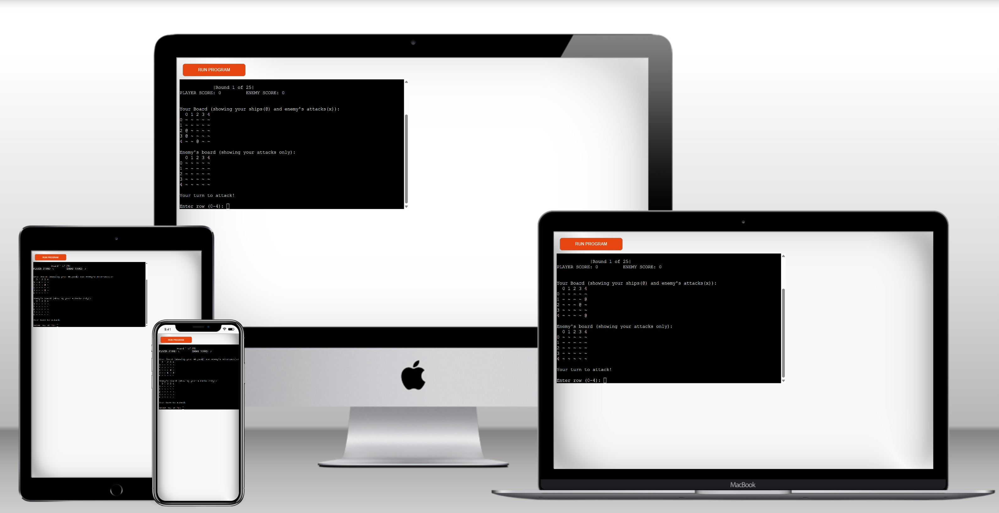

# ULTIMATE Battleships  

Ultimate Battleships is a Python terminal game where the player competes against the computer (the enemy) to sink all of their battleships first.  
The game runs entirely in the terminal and uses randomly generated boards for both the player and the computer. The user can try to beat the enemy's fleet by sinking all of their ships before the enemy sinks theirs. 

[Play the game here](https://battleship-war-3e77d46f915d.herokuapp.com/)

---

## How to play  

- At the start, the player chooses the **board size** (between 5×5 and 10×10).  
- Both the player and the computer will automatically receive ships, randomly placed on their boards.  
- Ships occupy a single square on the grid and are displayed with the **`@`** symbol on the player’s board (but hidden on the enemy’s board).  
- The player and computer take turns guessing coordinates on each other’s board.  

**Symbols used in the game:**  
- `~` → Water / Empty cell  
- `@` → Ship (only visible on the player’s board)  
- `X` → A successful hit  
- `O` → A miss  

The winner is the first to sink all of their opponent’s ships.  
If all possible moves are exhausted, the game ends in a **draw**.  

---

## Features  

### Existing Features

- **You can choose the size of the board from 5-10**  
  - Before the game starts, a question pops out asking the play to enter the size of the board.  
  - This can enhance the games difficulty and gives it more complexity!
 
  

- **You can choose to quit the game**  
  - After each turn the user is asked if he wants to continue.
  - If he chose "n", he breaks the loop and ends the game.  
  - Although the live version this feature doesn't make much sense, playing on the terminal is useful for preventing you to kill the terminal if you need to use it while you are playing.
 
 

- **Random Board Generation**  
  - Ships are randomly placed for both the player and computer.  
  - Player can see their ships but not the enemy’s.  

- **Player vs Computer Gameplay**  
  - Turn-based gameplay where both sides attack each round.  
  - The computer makes random guesses.  

- **Scoring System**  
  - Player and enemy scores are tracked throughout the game.  
  - The scoreboard is displayed at the start of each round.  
  
  

- **Input Validation & Error Handling**  
  - Prevents out-of-range coordinates.  
  - Prevents entering non-numeric values.  
  - Prevents attacking the same square twice.

    

---

### Future Features  
- Allow the player to select the number of ships.  
- Let players manually place their ships.  
- Add larger ships spanning multiple cells (e.g., 2×1 or 3×1).  
- Smarter AI that targets adjacent cells after a hit.  

---

## Data Model  

The game uses two main classes:  

- **`Board` class**  
  - Stores the grid, ships, and attack results.  
  - Methods include:  
    - `place_ships()` → randomly positions ships on the grid.  
    - `print_board()` → prints the grid (with or without hidden ships).  
    - `attack()` → processes guesses and updates the board.  
    - `all_ships_sunk()` → checks if all ships are destroyed.  

- **`BattleshipGame` class**  
  - Creates player and enemy boards.  
  - Tracks turns and scores.  
  - Handles game flow, alternating between player and enemy turns.  
  - Methods include:  
    - `play()` → main game loop.  
    - `get_player_move()` → validates and collects player input.  
    - `score()` → displays current scores.  

---

## Testing  

The game was manually tested with:  
- Invalid inputs (letters instead of numbers, out-of-bounds coordinates, duplicate guesses).  
- Multiple board sizes (5 to 10).  
- Full games until win, loss, or draw.  
- Verified that turns increment correctly and scores update properly.    

---

## Deployment
This game was developed locally using VS Code, and all commits were pushed to Heroku using Git. A Mock Terminal for Heroku was used for live access through the browser, which was provided by Code Institute. In order to get the application ready for deployment I followed the next steps:
1. Open the [template repository](https://github.com/Code-Institute-Org/p3-template) on GitHub provided by Code institute.
2. Click the green "Use this template" button at the top righ, and select "Create a new repository" to clone the repository.
3. With the repository you just create, copy the url on the green <> Code button in the upper right corner.
4. Open **VS Code** with **Terminal** > **New Terminal**.
5. In the terminal, `run git clone https://github.com/marcus-andre/battleship-game.git .` 
6. On the terminal window using the command `pip3 freeze > requirements.txt` the installed `requirements.txt` file, which contains a list of items to be installed, defining the modules imported to Heroku.
7. Create a [Heroku](https://www.heroku.com/) account.
8. Created the app in Heroku.
9. Went to the Settings tab in Heroku and clicked on the Reveal Config Vars button
10. on reveial config vars add `Key:PORT` with `Value:8000`.
11. Still on setting tab, went to Add Buildpack and selec Python and Nodejs.
12. Make sure Python is on top and Nodejs is at bottom.
13. Choose the Deployment method Github at the Deploy section.
14. Click `Connect to Github` button.
15. Then manually deploy clicking on `deploy branch` button.
16. The live link will appear on a `view` button when the deployment process finish.

---

## Bugs  

### Solved Bugs  
- **ANSI code for color**:Originally I used the ANSI code for color, after researched how to do so, to make the terminal more stylish. I descovered later that this just runs in the terminal and can cause problems after deployed in Heroku. Fixed it by removing all the ANSI codes.
- **Player attack inputs validation**: When player choose the same coordinates, the program wasnt wasking for new coordinates. It was skipping to the computer's turn. Fixed by add a while loop to keep asking for different coordinates as long as the same coordinates are chosen.
- **Repeated enemy guesses**: Computer sometimes was guessing repeated coordinates, which was given passing computer turns instead of guessing again. Fixed by adding a while loop for validation of the enemy's attacks and preventing repeated moves.   

### Remaining Bugs  
- None known.  

---

## Validator Testing  
- Code passed with **no errors** on PEP8 validation (pep8ci.herokuapp.com).  
